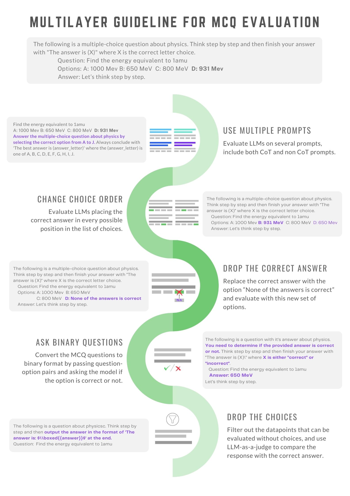

# MMLU-Pro-Max

This repository provides code for MMLU-Pro-Max, a modified version of the MMLU-Pro ([TIGER-Lab/MMLU-Pro](https://huggingface.co/datasets/TIGER-Lab/MMLU-Pro)) benchmark designed for a deeper and more realistic evaluation of large language models (LLMs). Traditional MCQ evaluations are widely used but often fail to capture a model’s true capabilities due to their sensitivity to input variations. MMLU-Pro-Max introduces a multilayer analysis approach that tests robustness across formatting, phrasing, and choice structure. Our codebase allows researchers to apply this evaluation framework on the MMLU-Pro dataset and beyond, enabling a more comprehensive assessment of LLM performance.




## Converting MMLU-Pro to MMLU-Pro-Max and Postprocessing

To create MMLU-Pro-Max manifests, you can run the following command:

```bash
python convert_and_save.py --save_dir=SAVE_DIR
```

This will convert the standard MMLU-Pro dataset into the **MMLU-Pro-Max** format, generating the necessary manifests for evaluation. 

Please note that this repository only provides the scripts for converting the original MMLU-Pro dataset into **MMLU-Pro-Max** and the postprocessing scripts that assume you've already evaluated a language model with the modified data files (manifests) and saved the results in a JSONL file. The expected format for the evaluation output is as follows:

- The results should be stored in a **JSONL file**.
- The key for each model response should be `"generation"`.

**Important:** The repository **does not** include any evaluation scripts. We provide the conversion and postprocessing utilities, but you are free to use any evaluation library or framework of your choice, as long as it adheres to the output format we've specified (with `"generation"` as the key for model responses).

If you prefer to evaluate your model using **NeMo-Skills**, we also provide a set of detailed evaluation steps tailored to that framework. These instructions are available within the repository, allowing you to seamlessly integrate with NeMo-Skills for evaluation.

## MMLUProMax Converters

Running the convert_and_save.py script will process the original MMLU-Pro dataset and save all the modified versions in the specified save directory (SAVE_DIR). During this process, several transformations will be applied to create different variations of the dataset for thorough evaluation. The following processing methods are applied:

- **<span style="color:teal;">MMLUProMaxMultiPromptConverter()</span>**
  *Does prompt matter?* Use 10 prompts to analyze accuracy variation.

- **<span style="color:teal;">MMLUProMaxChoiceOrderConverter()</span>**
  *Does the correct choice position matter?* The correct answer is always option A, option B, ... up to option J.

- **<span style="color:teal;">MMLUProMaxNoCorrectAnswerConverter(replace=True)</span>**
  *What if there is no correct answer?* Replace the correct answer with `"None of the answers is correct."`.

- **<span style="color:teal;">MMLUProMaxNoCorrectAnswerConverter(replace=False, random_loc=True)</span>**
  *What if there is no correct answer?* Remove the correct answer and randomly insert `"None of the answers is correct."`.

- **<span style="color:teal;">MMLUProMaxDropCorrectAnswerConverter()</span>**
  *What if there is no correct answer?* Drop the correct answer entirely.

- **<span style="color:teal;">MMLUProMaxBinaryConverter()</span>**
  *Can the model distinguish between correct and incorrect choices?* Convert a single question into multiple questions like:
  `"For the question, is this answer correct?"`.

- **<span style="color:teal;">MMLUProMaxGenerativeConverter()</span>**
  *Does performance in MCQ format transfer to real-life?* Leave questions that can be answered without options and directly ask the question.

# Running Inference

To evaluate a model on the MMLU-Pro-Max benchmark we recommend using [NeMo-Skills](https://github.com/NVIDIA/NeMo-Skills/tree/main)

The preprocessing scripts in this repository have already made all the necessary changes and adaptations to the prompts, ensuring that your data is ready for inference. As such, when running evaluation on NeMo-Skills, you should simply pass the trivial prompt described in `./config/empty_prompt.yaml`

Below is an example of how to evaluate a language model using NeMo-Skills on the MMLU-Pro-Max dataset. This script assumes that you have already processed the MMLU-Pro dataset and generated the manifests using the preprocessing steps provided.

Note that `MANIFEST_PATH` is the path to each manifest generated by `convert_and_save.py`
```bash
#!/bin/bash

# Set the necessary paths
CLUSTER_CONFIG_PATH="/path/to/cluster/config.yaml"
MODEL_PATH="/path/to/your/model"
OUTPUT_DIR="/path/to/output/results"
MANIFEST_PATH="/path/to/your/manifest.jsonl"
EMPTY_PROMPT_PATH="data/empty_prompt.yaml"
MODEL_CHAT_TEMPLATE="path/to/your/model/chat_template"

# Run the NeMo-Skills evaluation
ns generate \
       --cluster=${CLUSTER_CONFIG_PATH} \
       --server_type=vllm \
       --model=${MODEL_PATH} \
       --server_gpus=1 \
       --server_nodes=1 \
       --output_dir=${OUTPUT_DIR} \
       ++input_file=${MANIFEST_PATH} \
       ++prompt_config=${EMPTY_PROMPT_PATH} \
       ++prompt_template=${MODEL_CHAT_TEMPLATE} \
       ++inference.tokens_to_generate=2048 \
       ++batch_size=512 \
       ++skip_filled=True

```

For more detailed information on the configurations used in NeMo-Skills, including how to modify settings for different model types or inference environments, please refer to the [NeMo-Skills documentation](https://github.com/NVIDIA/NeMo-Skills/tree/main/docs).

### Postprocessing

After running the evaluation on your model, the next step is to postprocess the model predictions and extract the final answers. We provide several postprocessors tailored for different types of evaluations, that extract the final answer and map to the `extracted_answer` key in your output. You can use these postprocessing classes in your own scripts.

1. **MCQPostprocessor()**  
   - This postprocessor is used to extract the answer from **Multiple-Choice Question (MCQ)** evaluation predictions. It assumes that the model has provided a choice label (e.g., "A", "B", etc.) for each question. The postprocessor helps map the model's responses to the correct answers, ensuring they align with the original dataset.

2. **BinaryPostprocessor()**  
   - This postprocessor is designed for **binary evaluation** tasks, where each question can be classified as either correct or incorrect. The model's prediction is usually in a binary format, and the postprocessor will convert these into a readable output indicating whether the answer is correct or incorrect.

3. **GenPostprocessor()**  
   - This postprocessor is intended for **generative evaluation** predictions, where the model generates text as its output. The postprocessor extracts the final answer from these generative responses by interpreting the model’s free-form output and comparing it against the correct answers or expected patterns.

Feel free to use the postprocessing classes in your own scripts to extract the answer from models generation and save it mapped to the `extracted_answer` key.

# Generative Evaluatin and LLM-as-a-Judge
Pipeline for Generative Evaluation
1. Run inference on corresponding manifest
2. Use postprocessors.GenPostprocessor to extract prediction
3. Run inference on the judge model using **<span style="color:teal;">./config/judge.yaml</span>** prompt. We recommend using [Qwen-2.5 72B](https://huggingface.co/Qwen/Qwen2.5-72B-Instruct) as a judge.
For running the judge using Nemo_Skills use
```bash
ns generate \
        --generation_type=math_judge \
        --cluster=cluster_config_path \
        --model=/hf_models/Qwen2.5-72B-Instruct \
        --server_type=vllm \
        --server_gpus=8 \
        --server_nodes=1 \
        --output_dir=output_dir \
        ++input_dir=path_to_mainest \
        ++prompt_config=path_to_judge.yaml \
        ++prompt_template=nemo_skills/prompt/template/qwen-instruct.yaml \
        ++inference.tokens_to_generate=2048 \
        ++batch_size=512 \
        ++skip_filled=True
```
